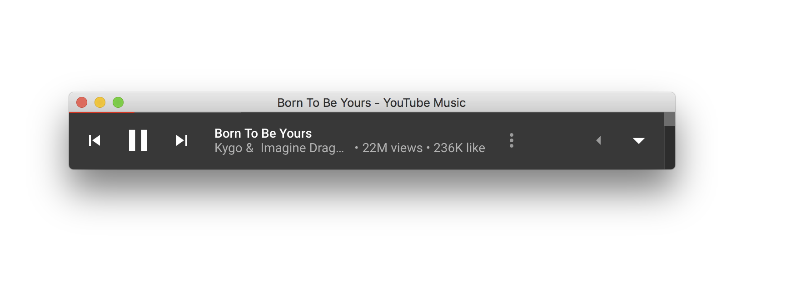

# Micro-Music-YouTube-Player



## To use:

```bash
# Clone this repository
git clone https://github.com/helmutgranda/Micro-Music-YouTube-Player
# Go into the repository
cd micro-music-youtube-player
# Install dependencies
npm install
# Run the app
npm start
```